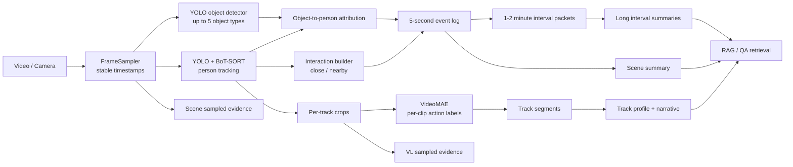

# Surveillance Pipeline Plan

## Goal

Build a single-camera surveillance pipeline that:

1. Tracks multiple people continuously with BoT-SORT.
2. Attributes up to five environment-specific object types to each person.
3. Produces 5-second event windows plus longer 1-2 minute summaries.
4. Uses a small VL model for fine-grained attributes and longer action summaries.
5. Supports question answering over structured logs and long summaries.

## Two Directions

### 1. Fine-grained visual attribution

Use VL on sampled track crops to infer:

- visible clothing colors
- outerwear
- helmet presence
- carried objects that are visibly confirmed

This stage should not replace detector/tracker outputs. It should refine and confirm them.

### 2. Longer-horizon action and scene summarization

Use:

- 5-second event logs for local chronology
- action segments from VideoMAE
- longer interval packets for 1-2 minute summaries

This stage should answer:

- who entered and left
- what objects they carried
- what changed over time
- which interactions happened and whether they were close or only nearby

## Current Implemented Pipeline



## What Was Added In This Repo

- environment presets with up to five object types
- structured track profile generation for VL or text backends
- longer interval summaries over 60-second chunks by default
- retrieval documents over windows, intervals, and tracks
- optional QA over retrieved context

## Recommended Datasets For Testing

### Best fit for multi-object tracking plus person-object reasoning

- TAO
  - use for multi-class video tracking
  - good for people, bags, carried objects, scene diversity

### Best fit for surveillance-style interactions

- VIRAT
  - use for fixed-camera surveillance behavior
  - good for enter / leave / interactions

- MEVA
  - use for larger surveillance activity detection
  - good for multi-person scene summaries

### Best fit for person actions

- AVA or AVA-Kinetics
  - use for action labels and action changes over time

## Do You Need Training?

### Short answer

- For a demo or initial system: no full retraining is required.
- For strong helmet / clothing / bag attribution in your target environment: yes, some finetuning is likely needed.

### Stage-by-stage

#### Detection and tracking

- Start with pretrained YOLO + BoT-SORT.
- Fine-tune only if your environment has domain-specific objects not covered by the base detector.
- Helmet recognition almost always needs a custom detector or fine-tuned model.

#### Action recognition

- Start with pretrained VideoMAE.
- Fine-tune if your actions are surveillance-specific and not covered well by Kinetics labels.

#### VL attribution

- Start zero-shot or prompted VL.
- Fine-tune only after you collect examples of the attributes you care about:
  - helmet / no helmet
  - bag types
  - clothing categories and colors

#### RAG

- No model fine-tuning is needed to start.
- First improve the structured evidence and retrieval quality.
- Fine-tune only if QA style becomes a bottleneck after retrieval is working.

## What To Record Yourselves

If public datasets are not enough, record short fixed-camera clips with:

- one person enters, stands, leaves
- two people cross paths without interacting
- two people approach and talk
- people carrying backpack / handbag / suitcase
- helmet vs no helmet if that matters
- clothing variation across days and lighting conditions

Annotate:

- track IDs
- enter / leave times
- object boxes
- helmet visibility
- pairwise interactions

## RAG Recommendation

Use RAG over structured evidence, not raw video frames.

Recommended retrieval units:

- 5-second event windows
- 60-second interval summaries
- per-track profiles

Recommended query types:

- who entered between t1 and t2
- did track X carry a bag
- who interacted with track Y
- what was person X wearing

## Phased Plan

### Phase 1

- run BoT-SORT + object attribution + 5-second event log
- verify timestamps and person IDs
- test on public videos

### Phase 2

- use VL for structured track profiles
- confirm clothing, helmet, and carried-object attributes

### Phase 3

- build 1-2 minute summaries
- add QA over retrieved interval / track evidence

### Phase 4

- collect your own data
- fine-tune detector for helmet or domain objects if needed
- fine-tune action model only if zero-shot labels fail

## Recommended Command Pattern

Basic:

```bash
python main.py --video /path/to/video.mp4 --device cuda --environment airport
```

With VL plus longer summaries plus QA:

```bash
python main.py \
  --video /path/to/video.mp4 \
  --device cuda \
  --object_backend sam3 \
  --environment airport \
  --event_window_sec 5 \
  --long_summary_sec 60 \
  --use_llm \
  --summary_backend vl \
  --llm_model google/gemma-4-E4B-it \
  --memory_db memory_store/surveillance_memory.db \
  --camera_id camera_1 \
  --question "Who entered the scene carrying a suitcase and who interacted with them?"
```

Persist one run to memory:

```bash
python main.py \
  --video /path/to/video.mp4 \
  --device cuda \
  --object_backend sam3 \
  --environment airport \
  --event_window_sec 5 \
  --long_summary_sec 60 \
  --use_llm \
  --summary_backend vl \
  --llm_model Qwen/Qwen2.5-VL-3B-Instruct \
  --memory_db memory_store/surveillance_memory.db \
  --camera_id camera_1
```

Start the chatbot over persisted memory:

```bash
python chat.py \
  --memory_db memory_store/surveillance_memory.db \
  --device cuda \
  --summary_backend text
```

Start the frontend:

```bash
streamlit run chat_frontend.py --server.port 8501 --server.address 0.0.0.0
```

If you are on a remote server, forward the port locally:

```bash
ssh -L 8501:localhost:8501 your_user@your_server
```

One-shot question over memory:

```bash
python chat.py \
  --memory_db memory_store/surveillance_memory.db \
  --device cuda \
  --question "Which people entered and left while carrying bags?"
```
